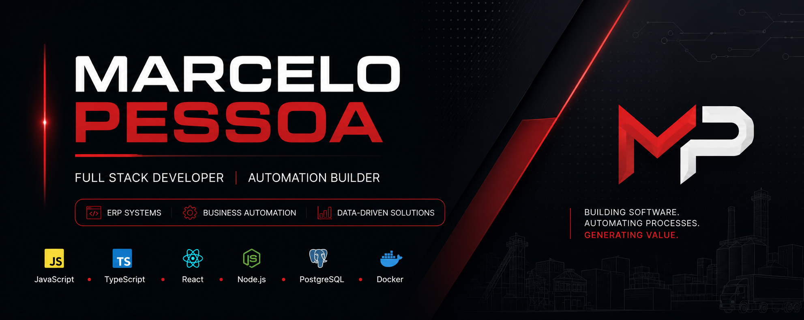

 

# Marcelo Pessoa

### Full Stack Developer • Automation Builder

Building ERP systems, business automation and data-driven solutions.

 

---

### Currently Building

* ConcreFuji ERP
* Concredados
* GranuloVision

---

### Tech Stack

---

### Experience

Building enterprise software, automation platforms and digital solutions focused on operational efficiency and process optimization.

---

### Stats

